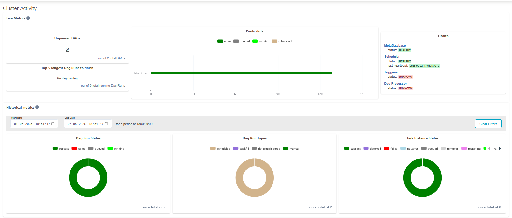

# HW7 - Kubeflow та AirFlow пайплайни

Цей проєкт демонструє створення ML пайплайнів із використанням Kubeflow Pipelines (KFP) та Apache Airflow.

## Структура проєкту

- `PR1_Kubeflow_Deployment/`: Інструкції з розгортання Kubeflow Pipelines
- `PR2_Kubeflow_Training_Pipeline/`: Пайплайн навчання з використанням Kubeflow
- `PR3_Kubeflow_Inference_Pipeline/`: Пайплайн інференсу з використанням Kubeflow Pipelines
- `PR4_Airflow_Deployment/`: Інструкції з розгортання Apache Airflow
- `PR5_Airflow_Training_Pipeline/`: Пайплайн навчання з використанням Airflow
- `PR6_Airflow_Inference_Pipeline/`: Пайплайн інференсу з використанням Apache Airflow

## Налаштування та запуск


### Встановлення залежностей

```bash
pip install -r requirements.txt
```

cd PR4_Airflow_Deployment
docker-compose down -v  # 
docker-compose build    #
docker-compose up -d    # 


