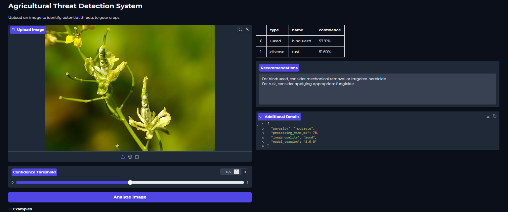

# Градіо-інтерфейс для розпізнавання загроз сільськогосподарським культурам

## Опіс проєкту

Цей інтерфейс на базі Градіо забезпечує зручний доступ до нашої моделі машинного навчання для ідентифікації загроз сільськогосподарським культурам. Завдяки інтуїтивно зрозумілому інтерфейсу користувачі можуть легко завантажувати зображення для аналізу та отримувати структуровані результати.

## Функціональні можливості

- Інтерактивний інтерфейс для завантаження та аналізу зображень
- Налаштування порогу впевненості моделі
- Відображення виявлених загроз у табличному форматі
- Рекомендації щодо управління виявленими загрозами
- Додаткові деталі у форматі JSON для поглибленого аналізу
- Приклади зображень для тестування функціональності

## Технічна архітектура

Інтерфейс побудований на фреймворку Gradio, який забезпечує швидке створення веб-інтерфейсів для моделей машинного навчання. Застосунок взаємодіє з API моделі через HTTP-запити, що дозволяє розгортати інтерфейс та модель окремо.

## Інструкція з встановлення

1. Встановіть необхідні залежності:
   ```
   pip install -r requirements.txt
   ```

2. Запустіть градіо-додаток:
   ```
   python app.py
   ```

3. Відкрийте браузер і перейдіть за адресою:
   ```
   http://localhost:7860
   ```

## Тестування

Для запуску автоматичних тестів використовуйте команду:
